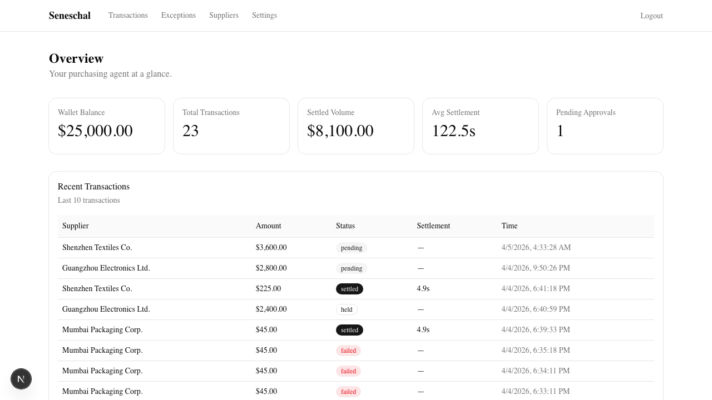

# Seneschal

An AI purchasing agent that automates cross-border supplier payments over stablecoin rails. Built on Tempo (Stripe's L1).

<p align="center">
  
  
</p>

This is a v0 prototype. It does one thing: takes a restock signal, checks a spend policy, and settles a payment to a supplier wallet in under 5 seconds. No card networks, no correspondent banks, no holds.

It exists to produce data showing the delta between card rails and stablecoin rails for automated international supplier payments. If the delta is real, v1 replaces the concierge layer with software and gives operators a dashboard to manage their own suppliers, limits, and exceptions.

---

## What it does

```
Restock signal → SKU lookup → Spend policy check → Stablecoin transfer → Audit log
```

That's the entire loop. A webhook comes in, the agent looks up the SKU, checks the supplier is approved and the amount is within limits, transfers stablecoins on Tempo, and logs every step. If something is outside policy, it holds the payment and asks the operator to approve or reject.

## What it doesn't do

- Route between suppliers
- Source new suppliers
- Handle multi-currency
- Replace your accountant

Those are v1+ problems. This is v0: prove the loop works, measure the settlement time, ship the data.

---

## Running the demo

### Prerequisites

- Node.js 20+
- A Neon Postgres database
- Access to Tempo moderato testnet

### Setup

```bash
npm install
```

Create `.env.development.local` with these values (**no quotes** — Next.js includes them literally):

```
POSTGRES_URL=postgresql://...
TEMPO_PRIVATE_KEY=0x...
TEMPO_RPC_URL=https://rpc.moderato.tempo.xyz
TEMPO_CHAIN_ID=42431
TEMPO_USDC_ADDRESS=0x20c0000000000000000000000000000000000000
JWT_SECRET=any-random-string-here
```

`TEMPO_USDC_ADDRESS` points to PathUSD on the moderato testnet. Tempo has four test stablecoins (PathUSD, AlphaUSD, BetaUSD, ThetaUSD) — PathUSD is the one we use.

### Push the schema and seed

```bash
npx drizzle-kit push
npm run seed
```

The seed creates one operator (`demo@acme.com` / `demo1234`), three suppliers, six SKUs, and a history of transactions and exceptions so the dashboard isn't empty.

### Fund the wallet

Tempo moderato has a faucet built into the RPC:

```bash
cast rpc tempo_fundAddress 0xYOUR_SENDER_ADDRESS --rpc-url https://rpc.moderato.tempo.xyz
```

This gives you $1,000 of each test stablecoin. Gas on Tempo is paid in USD stablecoins — no separate gas token.

### Start the server

```bash
npm run dev
```

### Fire a transaction

```bash
curl -X POST http://localhost:3000/api/webhook \
  -H "Content-Type: application/json" \
  -d '{
    "operatorId": "YOUR_OPERATOR_UUID",
    "skuCode": "PKG-001",
    "quantity": 3
  }'
```

You should get back a settled transaction with a tx hash and settlement time under 5 seconds. Log in to the dashboard at `http://localhost:3000/dashboard` to see it.

### Trigger an exception

Use a quantity that pushes the amount over the supplier's approval threshold:

```bash
curl -X POST http://localhost:3000/api/webhook \
  -H "Content-Type: application/json" \
  -d '{
    "operatorId": "YOUR_OPERATOR_UUID",
    "skuCode": "ELEC-001",
    "quantity": 20
  }'
```

This creates a held transaction. Go to `/dashboard/exceptions` to approve or reject it.

---

## Project structure

```
src/
  app/
    page.tsx                  Landing page
    dashboard/                Operator dashboard
      page.tsx                Overview (balance, stats, recent txns)
      transactions/           Transaction list
      exceptions/             Pending + resolved exceptions (approve/reject)
      suppliers/              Supplier list
      settings/               Spend policy viewer
    api/
      webhook/                Restock signal intake → triggers pipeline
      transfer/               Manual USDC transfer
      transactions/           Transaction queries
      exceptions/             Exception queries + resolution
      health/                 Health check + stats
      waitlist/               Waitlist signups
  lib/
    pipeline/                 Core loop: policy check, exception handling
    tempo/                    viem client, stablecoin transfer, ERC-20 ABI
    db/                       Drizzle client + schema
    auth/                     JWT sessions, password hashing
    audit.ts                  Append-only audit log
    config.ts                 YAML spend policy loader
  config/
    spend-policy.yaml         Spend policy definition
scripts/
  seed.ts                     Demo data seed
strategy/
  product-spec.md             Full product spec (v0 + v1)
  demo-readiness.md           What's done, what's left
  plan.md                     Landing page plan
  positioning.md              Messaging + ICP
```

## Tech stack

Next.js 15 · TypeScript · Neon Postgres · Drizzle ORM · viem · Tailwind CSS v4 · shadcn/ui
